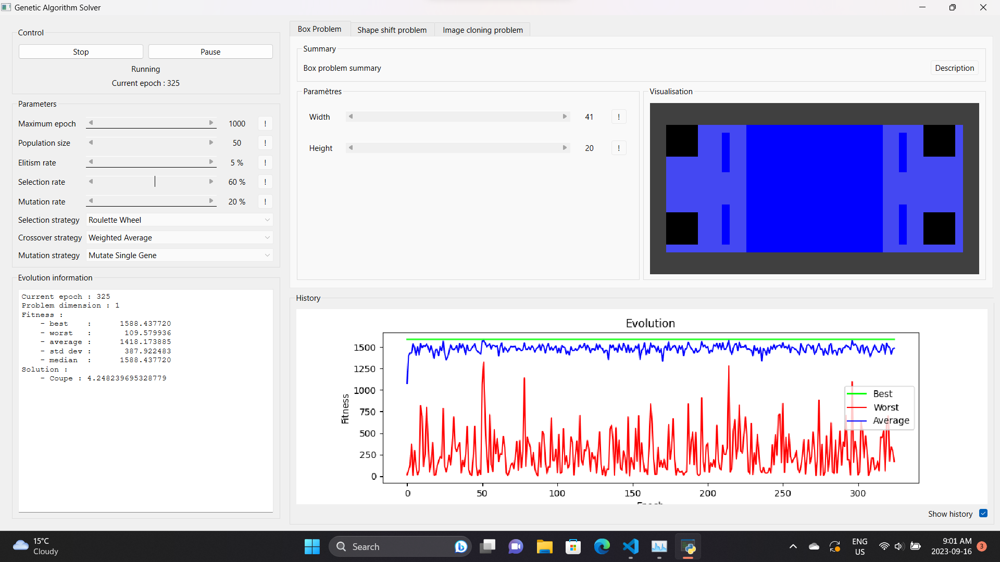
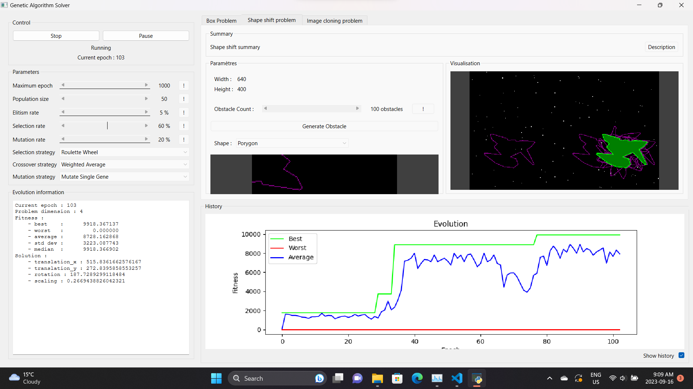
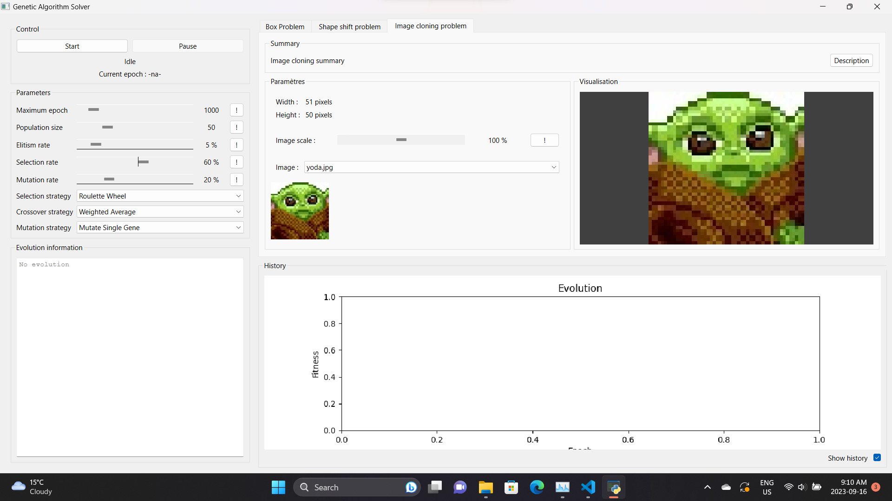
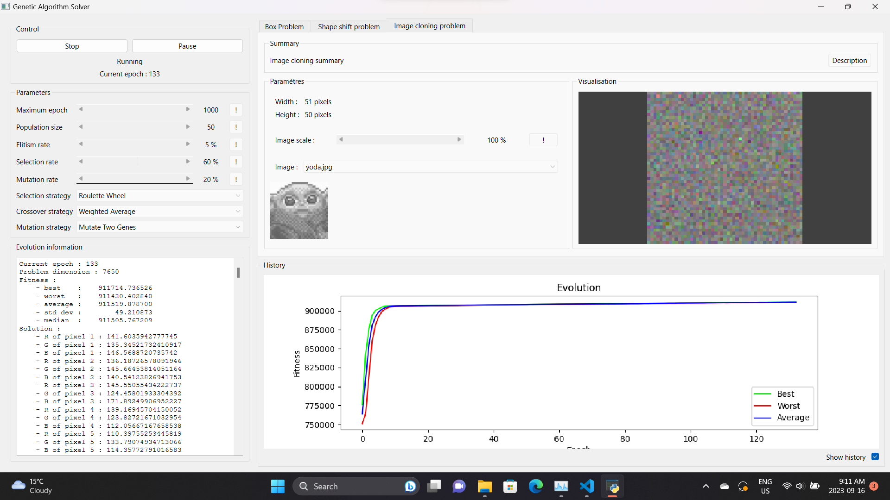
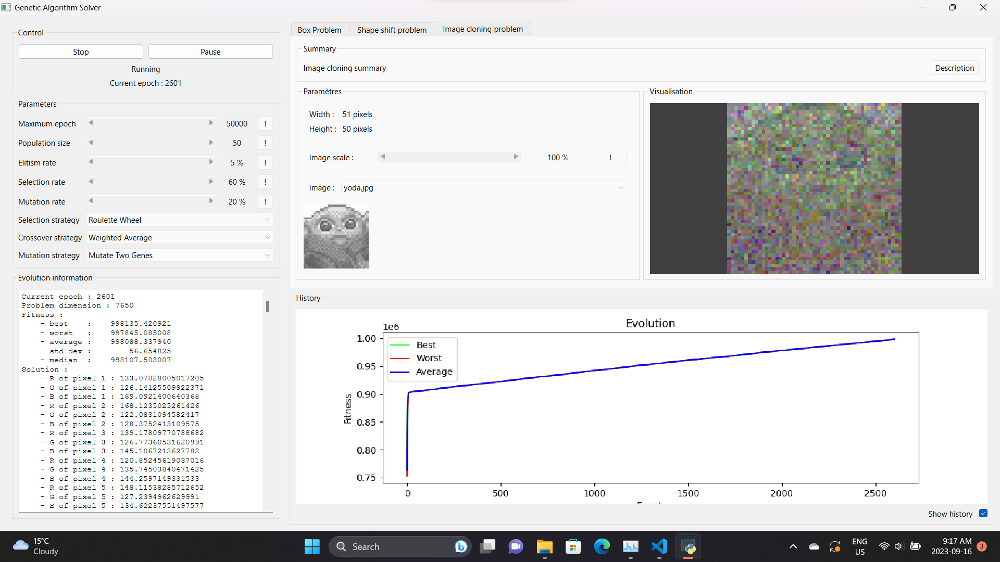
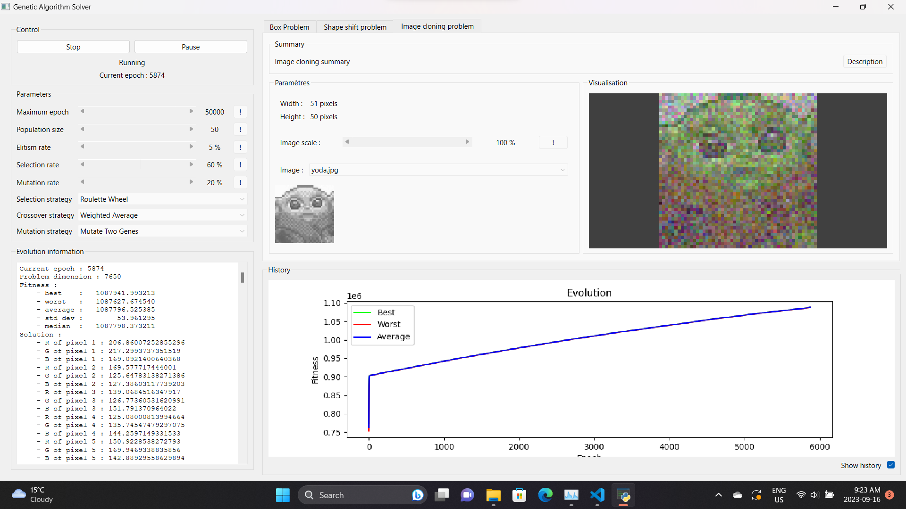
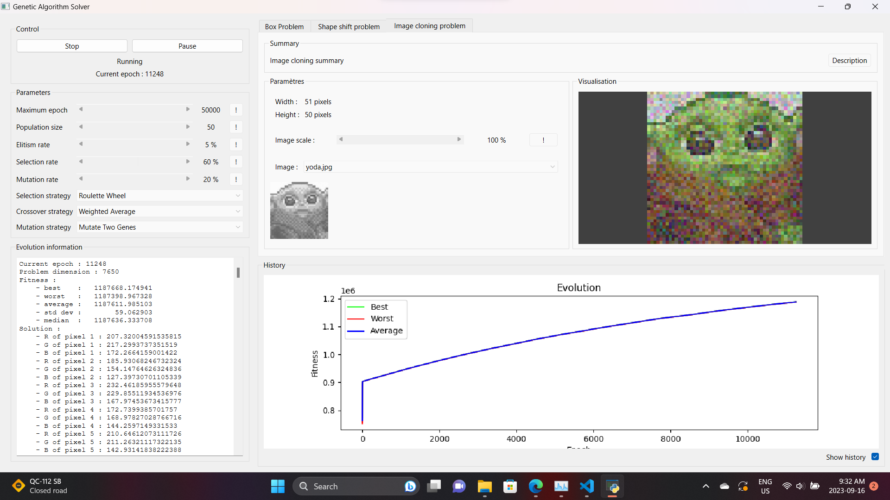
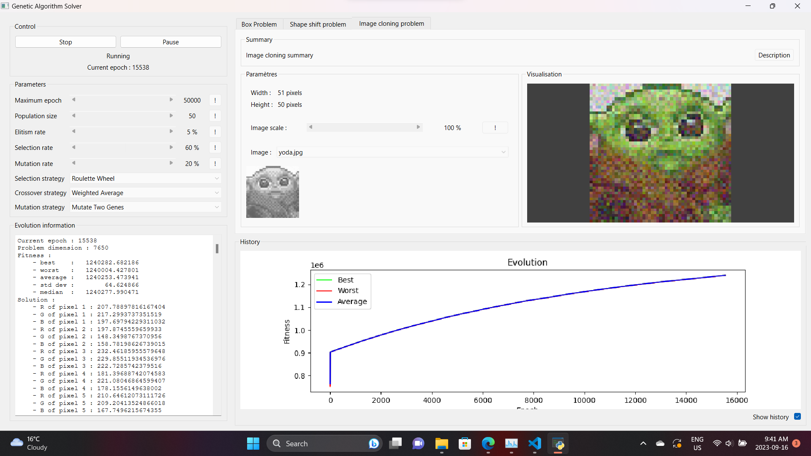

<a name="readme-top"></a>

### This project was init from [this project](https://github.com/cryptoblivious/Genetic-Algorithm)(private) as part of the amazing JAAT team : [Cryptoblivious](https://github.com/cryptoblivious), [Alexis Provost](https://github.com/alexisprovost?tab=overview&from=2023-09-01&to=2023-09-16) and [Thomas Pelletier](https://github.com/Thomkiller)

<div align="center">


<h1 align="center">Genetic Algorithm</h1>

  <p align="center">
    A program that uses a genetic algorithm to find the best solution to a given problem.
  </p>
</div>


<!-- TABLE OF CONTENTS -->
<details>
  <summary>Table of Contents</summary>
  <ol>
    <li>
      <a href="#about-the-project">About The Project</a>
      <ul>
        <li><a href="#built-with">Built With</a></li>
      </ul>
    </li>
    <li><a href="#usage">Usage</a></li>
    <li><a href="#contact">Contact</a></li>
    <li> 
  </ol>
</details>


<!-- ABOUT THE PROJECT -->
## About The Project
<h3 align="center">
    Genetic Algorithm Program Overview:
</h3>
  <p align="justify">
    In our genetic algorithm program, a range of functionalities empowers users to direct evolutionary simulations with precision. Users possess the capability to initiate, pause, and terminate simulations at will, affording full control over the optimization process. Furthermore, users may specify crucial simulation parameters, encompassing the number of epochs, population size, elitism rate, selection rate, and mutation rate, thus customizing the algorithm's behavior to suit the demands of specific optimization tasks. The program offers multiple mutation strategies, promoting adaptability. A textual interface allows real-time tracking of simulation progress, while a graphical component provides a visual representation of evolutionary developments.
  </p>
  <h3 align="center">
    Problem 1: Maximizing Box Volume through Corner Folding:
</h3>
  <p align="justify">
   A central problem addressed by our genetic algorithm is the quest for optimal corner folding of a box to maximize internal volume. This intricate challenge necessitates the exploration of diverse corner folding configurations to identify the arrangement that maximizes spatial utilization. The algorithm systematically explores the manifold possibilities of corner manipulation, considering the initial box configuration and the feasibility of folding. Via iterative evolution, it converges toward the most optimal folding arrangement, rendering valuable solutions for spatial optimization and box design dilemmas.
  </p>
  <h3 align="center">
   Problem 2: Shape Fitting within Obstacle-Laden Canvases:
    </h3>
   <p align="justify">
   Another significant problem addressed by our genetic algorithm involves the fitting of shapes within a canvas marked by obstacles. Users retain the capacity to specify the number of obstacles present on the canvas, ranging from none to a hundred, and select the shape to be fitted, with options including a rectangle, triangle, or the complex Pokémon Porygon shape. The algorithm confronts this challenge by iteratively adjusting the position and orientation of the chosen shape, while adhering to the boundaries defined by obstacles. The objective here is to maximize the coverage of the canvas while respecting the presence of obstacles, thereby offering a pertinent solution for a spectrum of spatial planning scenarios.
  </p>
  <h3 align="center">
    Problem 3: Image Cloning with Gradual Canvas Replication:
    </h3>
   <p align="justify">
  The final application within our program entails image cloning. Users are afforded the opportunity to select an image from a predefined set, instigating a process wherein the canvas incrementally replicates the chosen image. This visually captivating representation demonstrates the algorithm's proficiency in mimicking intricate patterns by the gradual introduction of shapes. It serves as both an artistic endeavor and a practical manifestation of the genetic algorithm's versatility in reproducing intricate designs.
  </p>


<p align="right">(<a href="#readme-top">back to top</a>)</p>


### Built With

[![VSCode][vscode-img]][vscode-url]
[![Python][python-img]][python-url]
[![Pillow][pillow-img]][pillow-url]
[![Qt][qt-img]][qt-url]
[![Pyside6][Pyside6-img]][Pyside6-url]
[![Numpy][numpy-img]][numpy-url]


<!-- USAGE EXAMPLES -->
## Usage

### Prerequisites

You need to have python installed, if not you can download it here: [https://www.python.org/downloads/](https://www.python.org/downloads/)

### Installation

1. Clone the repo
   ```sh
   git clone "https://github.com/Jon-Robb/genetic_algorithm.git"
   cd genetic_algorithm
   cd ga
    ```
2. Install pillow
   ```sh
   pip install pillow
   ```
3. Install numpy
   ```sh
    pip install numpy
    ```
4. Install PySide6
   ```sh
    pip install PySide6
    ```
5. Run the program
   ```sh
    python main.py
    ```
    </br>


<p align="right">(<a href="#readme-top">back to top</a>)</p>


<br/>
<h3 align="center"> Box Solution </h3>
<p align="center">
  
</p>
<br/>
<h3 align="center"> Shape solution </h3>
<p align="center">
  
</p>
<br/>
<h3 align="center"> Image cloning solution, watch the result come to life </h3>
<p align="center">
  <span> 
  
  
  
  
    
  
   </span>
</p>

<br/>


<p align="right">(<a href="#readme-top">back to top</a>)</p>


<!-- CONTACT -->
## Contact

[![LinkedIn][linkedin-shield]][linkedin-url] 
[![Gmail][gmail-shield]][gmail-url]
[![Portfolio][portfolio-shield]][portfolio-url]


<p align="right">(<a href="#readme-top">back to top</a>)</p>


<!-- MARKDOWN LINKS & IMAGES -->
<!-- https://www.markdownguide.org/basic-syntax/#reference-style-links -->
<!-- images -->
[linkedin-shield]: https://img.shields.io/badge/-LinkedIn-black.svg?style=for-the-badge&logo=linkedin&colorB=555
[linkedin-url]: https://linkedin.com/in/jonathan-robinson-187716274
[gmail-shield]:	https://img.shields.io/badge/Gmail-D14836?style=for-the-badge&logo=gmail&logoColor=white
[gmail-url]: mailto:robinsonjonathan240817@gmail.com
[portfolio-shield]:https://img.shields.io/badge/website-000000?style=for-the-badge&logo=About.me&logoColor=white
[portfolio-url]: https://jonrobinson.ca


<!-- built with  -->
[vscode-img]: https://img.shields.io/badge/vs%20code-007ACC?style=for-the-badge&logo=visual-studio-code&logoColor=white
[vscode-url]: https://code.visualstudio.com/
[python-img]: https://img.shields.io/badge/python-3776AB?style=for-the-badge&logo=python&logoColor=white
[python-url]: https://www.python.org/
[pillow-img]: https://img.shields.io/badge/pillow-3776AB?style=for-the-badge&logo=python&logoColor=white
[pillow-url]: https://pillow.readthedocs.io/en/stable/
[qt-img]: https://img.shields.io/badge/qt-3776AB?style=for-the-badge&logo=python&logoColor=white
[qt-url]: https://www.qt.io/
[Pyside6-img]: https://img.shields.io/badge/pyside6-3776AB?style=for-the-badge&logo=python&logoColor=white
[Pyside6-url]: https://doc.qt.io/qtforpython/
[numpy-img]: https://img.shields.io/badge/numpy-3776AB?style=for-the-badge&logo=python&logoColor=white
[numpy-url]: https://numpy.org/